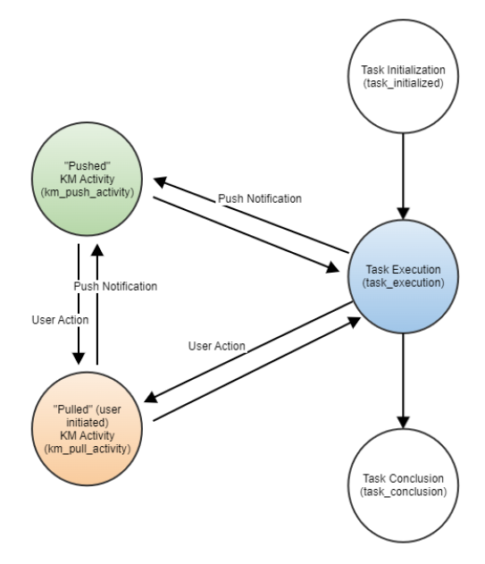

# Knowledge Management Evaluation Data Requirements

## Collection Format

The evaluation data output format requires a JSON and a JSONL file for each _subject-task_ combination.

The _JSON_ will contain _aggregated_ statistics for given _subject-task_ combinations. An example of this type of file is given in `sample_subject_task.json`.

The _JSONL_ will contain detailed information on system state transition times during each task execution. An example of this type of file is given in `sample_state_transitions.jsonl`.

A task metadata CSV should be included as well. The CSV should contain column names `task_id`, `task_optimal_time_in_seconds`, and `task_maximum_score` and a row for each task in the evaluation. An example task metadata CSV is given in `sample_task_metadata.csv`.

The filenames for each of the above filetypes should conform to the following format:
- subject-task JSON:  `<subject_id>_<task_id>.json`
- state-transition JSONL: `<subject_id>_<task_id>_state_timestamps.jsonl`
- task metadata CSV:  `task_metadata.csv`

General information and any additional definitions/caveats may be required to interpret the final evaluation outputs. It is encouraged that this sort of information is documented. This information could include the following:
- mapping of task identifiers to explicitly defined tasks
- explanation of the task grading scheme
- task failure criteria (if applicable)
- maximum time limits for each task (if applicable)

## Collection Format Formal Definitions

Formal definitions for and examples of the _subject-task_ JSON and the JSON objects which compose the _state-transition_ JSONL files are as follows:

### Subject-Task JSON Object Definition
```
{
    'subject_id' : <anonymized subject identifier>,
    'condition' : <'prototype' or 'baseline'>,
    'task_id' : <task identifier>,
    'task_start_time' : <ISO 8601 UTC Timestamp when task is initialized>,
    'task_total_time' : <total task time in seconds>,
    'km_pull_total_time' : <total time spent in the km_pull_activity state, in seconds>,
    'km_push_total_time' : <total time spent in the km_push_activity state, in seconds>,
    'task_grade' : <numeric/ordinal task grade>,
    'corpus_knowledge_nugget_count' : <count of corpus knowledge nuggets pushed during task>,
    'expert_captured_nugget_count' : <count of expert captured nuggets pushed during task>,
    'nugget_content' : <
        list of dictionaries containing pushed nugget text content in format:
            {
                'content' : <nugget text>,
                'timestamp' : <ISO 8601 UTC Timestamp when nugget was pushed>,
                'type' : <'corpus knowledge' or 'expert captured knowledge'>,
            },
            ...
    >,
    'task_timeout' : <boolean true/false; indicates whether participant exceeded time limit for task>,
    'optional_content' : <object/dictionary with optional content; formatted as needed>,
}
```
The `nugget_content` field should contain text that was pushed to the participants during the course of a task they were completing.  In the event that a pushed nugget is multi-media (i.e. containing images/video), a text identifier should be submitted to the `content` field that identifies the pushed nugget.  Static file representations of all pushed multi-media nuggets should be documented for later reference.

### State Transition JSON Object Definition
```
{
    'subject_id' : <anonymized subject identifier>,
    'condition' : <'prototype' or 'baseline'>,
    'task_id' : <task identifier>,
    'utc_timestamp' : <ISO 8601 UTC Timestamp>,
    'state_id' : <identifier that indicates state of the system that participant transitioned to; can be any of following:  'task_initialized', 'task_execution', 'km_push_activity', 'km_pull_activity', 'task_conclusion'>,
    'optional_content' : <object/dictionary with optional content; formatted as needed>,
}
```
An example for how the utc_timestamp variable can be generated via Python is presented below:

```
from datetime import datetime
import pytz

# Current time in UTC
current_time_utc = datetime.now(pytz.utc)

# ISO 8601 timestamp with timezone
iso_timestamp_with_timezone = current_time_utc.isoformat()'''
iso_timestamp_with_timezone = current_time_utc.isoformat()
```

Note that for a given _subject-task_ combination, all state-transition JSON _objects_ will be stored within one single JSONL _file_.

## Knowledge Management Evaluation State Space

The below state model shows an abstraction of a participant's "Knowledge Management System Evaluation State Space".  The most common states a participant will be in during the completion of a task include "Task Execution", "Pushed KM Activity", and "Pulled KM Activity". Timestamps shall be recorded every time an edge of this state model is traversed (i.e. anytime when a state transition occurs) and logged in the state-transition JSONL. Note that a direct transition from a _"Pulled" KM Activity_ to a _"Pushed" KM Activity_ would only occur when an unsolicited KM push notification occurs while a participant is still querying/reviewing/contextualizing information received from a _"Pulled" KM Activity_.

