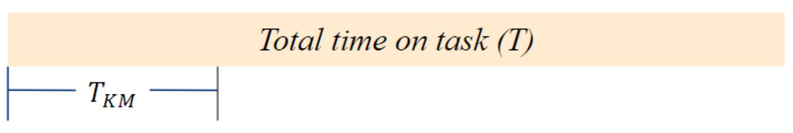
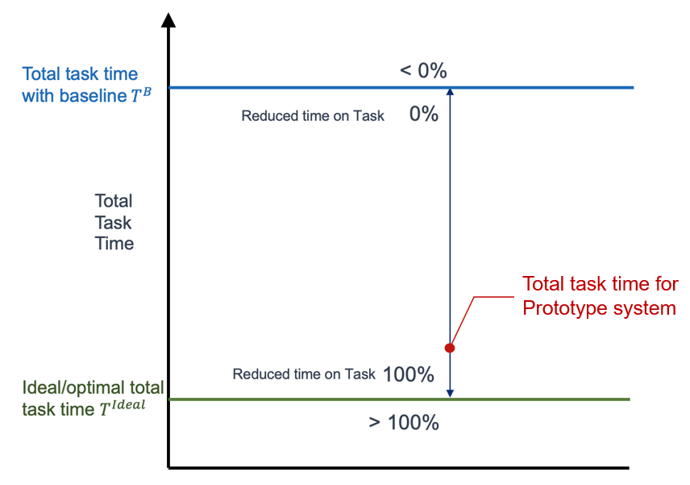

# Knowledge Management System Metrics

Two key metrics that are key to evaluating knowledge management systems include _reduce time on task_ and _reduce task failure rate_.  An additional ancillary metric that can be used includes:  _percent increase in task productivity_.

There are some basic definitions we'll need before proceeding to the specifics:

### Proportional Increase

$a_{new}=a + (f*a)$

where $f = 0.1$ => 10% increase (new quantity is $1.1a$)
and $f = 1.0$ => 100% increase (new quantity is $2a$)

### Proportional Decrease

$a_{new}=a - (f*a) = a * (1-f)$

where $f = 0.1$ => 10% decrease (new quantity is $0.9a$)
and $f = 1.0$ => 100% decrease (new quantity is $0$)

## Reduce Time on Task Metric

### Approach 1: KM Time Proportional Reduction

Now that we have these basic definitions, we can define approach 1 for the _Reduce Time on Task_ metric

First, some terminology:
- $T^{i,c} \equiv$ total time user $i$ takes to complete task while in condition $c$ (where $c$ is either $B$ for Baseline or $S$ for Prototype)
- $T_{KM}^{i,c} \equiv$ time that user $i$ spends on knowledge management activities while in condition $c$
- $t_{KM}^{i,c} \equiv T_{KM}^{i,c} / T^{i,c}$, the fraction of time the user $i$ spends on KM activities while in condition $c$
- $\overline{t_{KM}^{S}} \equiv (\sum_{i=1}^{N_S} t_{KM}^{i,S})/N_S$ represents the _average_ fraction of time users spend on KM activities while in Prototype condition, where $N_S$ represents the number of participants who completed the task in the Prototype condition
- $\overline{t_{KM}^{B}} \equiv (\sum_{i=1}^{N_B} t_{KM}^{i,B})/N_B$ represents the _average_ fraction of time users spend on KM activities while in Baseline condition, where $N_B$ represents the number of participants who completed the task in the Baseline condition

We can then calculate the proportional reduction for time on task:

$p_{TT} = 1 - \dfrac{\overline{t_{KM}^{S}}}{\overline{t_{KM}^{B}}}$

Note that this formula is simply 1 minus the average of KM time proportions for Prototype condition participants divided by the KM time proportions for Baseline condition participants.

The final result should be converted to a percent:

$P_{TT} = 100 * p_{TT}$

Note that some undesirable edge case effects can occur with this calculation when 2 possible conditions are met:
1. The Prototype condition KM time proportion is more than 2 times the Baseline KM time proportion, or $\overline{t_{KM}^{S}} \gt 2 * \overline{t_{KM}^{B}}$ (this results in a value less than $-100%$)
2. The Baseline condition KM proportion equals $0$, resulting in a divide by zero error, or $\overline{t_{KM}^{B}} = 0$

When either of these conditions are met we will enforce a floor function, that forces the final $P_{TT}$ value to equal $-100%$

This leads to an intuitive range of results, where:
- 100% implies the Prototype system KM Time proportion is zero
- 0% implies equal proportions between Prototype and Baseline systems
- -100% implies Prototype KM time proportion is double (or more) of the Baseline KM time proportion OR Baseline KM time proportion average is equal to zero

### Approach 2:  Optimal Total Task Time

The second approach to the _Reduce Time on Task_ metric does not distinguish between task time and KM time, but simply considers total time.

The emphasis on this approach is with regard to how much the use of the Prototype system can drive the total task completion time down towards an _expert time_ or _optimal time_.

_expert time_ can be understood as the total amount of time an expert would take on the task if they had no need for any _knowledge management_ information.

The output of this measurement represents the percent distance proximity to the _expert time_, as calculated by:

$1 - \dfrac{\overline{T^{S}} - T_{exp}}{\overline{T^{B}} - T_{exp}}$ where

- $\overline{T^{S}} \equiv \sum_{i=1}^{N_S} T^{i,S} / N_S$ represents the average of total times over Prototype condition participants, where $N_S$ is the number of Prototype condition participants
- $\overline{T^{B}} \equiv \sum_{i=1}^{N_B} T^{i,B} / N_B$ represents the average of total times over Baseline condition participants, where $N_B$ is the number of Baseline condition participants
- $T^{exp} \equiv$ the _expert time_ for the task

Similar to the approach 1 measurement, this metric has the ability to go below -100%; as a result a minimum value of -100% floor is also enforced for this metric.

This allows the resulting measurement to range as follows:
- 100% implies the Prototype system brings the total task time down to expert time
- 0% implies that Prototype total task time equals Baseline total time
- -100% implies that Prototype time is double (or more) of the Baseline total task time

### Approach 1 versus Approach 2

Each approach has particular advantages and disadvantages associated with it.

Regarding approach 1:
- Key Assumption:  It is possible to identify "KM activities" within a task
- Advantages:
  - This is sensitive to significant changes in performance
  - Provides an easy-to-interpret percentage value
- Disadvantages:
  - Assumes it is possible to cleanly define "KM time" (or effort) within a task
  - Ignores changes in overall task time
  - Penalizes Prototype system if KM time grows but overall task is faster
  - May not be possible to reach 100% reduction (reduce KM time to 0)

Regarding approach 2:
- Key Assumption:  It is possible to identify an expert/optimal task time
- Advantages:
  - Sensitive to significant changes in performance
  - Can reach 100% reduction
- Disadvantages:
  - Assumes it is possible to define optimal/expert time performance

## Reduce Task Failure Rate

For the _reduce task failure rate_ metric, we define the following terms:

We define the following terms:
- $M \equiv$ maximum success score for a task
- $SS^{i,c} \equiv$ task success score for participant $i$ while in condition $c$, where $0 \leq SS \leq M$
- $\overline{SS^{S}} \equiv \dfrac{\sum_{i=1}^{N_S} SS^{i,S}}{N_S}$ is the average task success score for Prototype participants, where $N_S$ is the number of Prototype participants who completed that task.
- $\overline{SS^{B}} \equiv \dfrac{\sum_{i=1}^{N_B} SS^{i,B}}{N_B}$ is the average task success score for Baseline participants, where $N_B$ is the number of Baseline participants who completed that task.
- $f^{S} \equiv \dfrac{M-\overline{SS^{S}}}{M}$ is the task failure rate for the Prototype system
- $f^{B} \equiv \dfrac{M-\overline{SS^{B}}}{M}$ is the task failure rate for the Baseline system

With this, we can then define the proportional reduction for task failure as:

$p_{TF} = 1 - \dfrac{f^{S}}{f^{B}}$

The final result should be converted to a percent:

$P_{TF} = 100 * p_{TF}$

This metric is prone to similar undesirable edge cases as the _reduce time on task_ metric, Approach 1.  We are concerned about two conditions:

1. The Prototype condition failure rate is more than 2 times the Baseline KM time proportion, or $f^{S} > 2 * f^{B}$ (this results in a value less than $-100%$)
2. The Baseline condition task failure rate equals $0$, resulting in a divide by zero error, or $f^{B} = 0$

When either of these conditions are met we will enforce a floor function, that forces the final $P_{TF}$ value to equal $-100%$

This leads to an intuitive range of results, where:
- 100% implies the Prototype system task failure rate is zero
- 0% implies equal task failure rates between Prototype and Baseline systems
- -100% implies Prototype task failure rate is double (or more) of the Baseline failure rate OR Baseline average failure rate is equal to zero

## Percent Increase in Task Productivity

For the _percent increase in task productivity_ metric, we define the following terms:

- $M \equiv$ maximum success score for a task
- $SS^{i,c} \equiv$ task success score for participant $i$ while in condition $c$, where $0 \leq SS \leq M$
- $T^{i,c} \equiv$ total time user $i$ takes to complete task while in condition $c$ (where $c$ is either $B$ for Baseline or $S$ for Prototype)
- $TP^{S} \equiv \dfrac{\sum_{i=1}^{N_S} SS^{i,S}}{\sum_{i=1}^{N_S} T^{i,S}}$ is the Prototype task productivity for a single task, where $N_S$ is the number of Prototype participants who completed that task.
  - **Straightforward interpretation**: If $TP^{S}$ = 5% per min, it implies that each additional minute on a task will yield an additional 5% of task completion while using the Prototype system (aggregated across all Prototype participants)
- $TP^{B} \equiv \dfrac{\sum_{i=1}^{N_B} SS^{i,B}}{\sum_{i=1}^{N_B} T^{i,B}}$ is the Baseline task productivity for a single task, where $N_B$ is the number of Baseline participants who completed that task.

With these terms, we can then define the _percent increase in productivity_ for a single task as:

$P_{TP} = \frac{TP^{S} - TP^{B}}{TP^{B}} * 100$

This is a helpful additional _ancillary_ metric due to possible challenges with the _reduce time on task_ metric...the _reduce time on task_ metric could provide misleading results when participants consistently complete tasks incorrectly (i.e. with a low task grade) or artificially complete tasks quickly (for example, if participants give up early).  In other words, the _reduce time on task_ metric can be misleading if analyzed independently from the _reduce task failure rate_ metric.

This _productivity_ metric helps avoid that concern by aggregating over all participants for a task and representing the relationship between _task grade_ and _time to completion_ within the metric itself.

## Statistical Tests

Statistical tests can be applied for each individual task, comparing the data/distributions from the Prototype condition participants with the data/distributions from the Baseline condition participants.  These tests can help ensure that the _reduce time on task_ and _reduce task failure rate_ metric calculations are trustworthy with the knowledge that each condition's distribution mean has statistically significant differences.

### Reduce Time on Task

For the _reduce time on task_ metric, a statistical test can be applied comparing the total time distribution for the Prototype system, with the total time distribution for the Baseline.  Under the assumption that total time data will be normally distributed across participants within a test condition, a 1-sided, 2-sample independent t-test can be applied with the below Null and Alternative Hypotheses:
- H0: The mean of the Prototype system total task time distribution _is equal to or greater than_ the mean of the Baseline system total task time distribution
- H1: The mean of the Prototype system total task time distribution _is less than_ the mean of the Baseline system total task time distribution

Statistical significance will be established if a p-value less than or equal to $0.05$.

### Reduce Task Failure Rate

For the _reduce task failure rate_ metric, a statistical test can be applied comparing the task grade distribution for the Prototype system, with the task grade distribution for the Baseline.  Under the assumption that task grade data will be _non-parametric_ (i.e. it won't fit any known parameterized distribution), a 1-sided, 2-sample independent Mann-Whitney non-parametric test can be applied with the below Null and Alternative Hypotheses:
- H0: The mean of the Prototype system task grade distribution _is equal to or less than_ the mean of the Baseline system task grade distribution
- H1: The mean of the Prototype system task grade distribution _is greater than_ the mean of the Baseline system task grade distribution

Statistical significance will be established if a p-value less than or equal to $0.05$.

### Estimating required participant counts

Having a sufficiently high participant count will be important in assuring statistical significance in the above statistical tests.  As an aid for estimating the required participant counts, a notebook is included in this repo, _statistical_analysis.ipynb_.  This notebook can be referenced when determining what participant counts are required for a given evaluation.

The notebook enables the creation of synthetic datasets that assumed/expected the Prototype and Baseline data distributions.  With these synthetic datasets, the statistical tests can be applied to explore whether statistical significance is achieved.  Additional details are included in the notebook.
